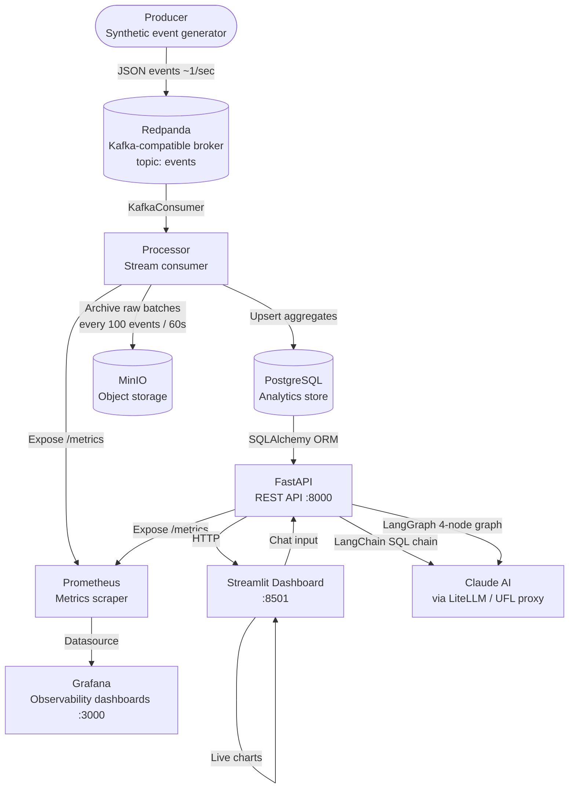

# RetailBrain: AI-Powered Real-Time Commerce Intelligence

An event-driven distributed intelligence platform that processes real-time retail events through Kafka/Redpanda streaming pipelines with FastAPI services, observability tooling (Prometheus/Grafana), and scalable operational analytics infrastructure — powered by Claude AI via LangChain and LangGraph.

---

## Architecture & Data Flow



---

## Services & Ports

| Service | Port | Role |
|---|---|---|
| FastAPI | 8000 | REST API + AI endpoints |
| Streamlit | 8501 | Business dashboard + AI chat |
| Grafana | 3000 | Observability dashboards (admin/admin) |
| Prometheus | 9090 | Metrics time-series DB |
| MinIO console | 9001 | Raw event archive (minioadmin/minioadmin) |
| Redpanda | 9092 | Kafka-compatible event broker |
| PostgreSQL | 5432 | Analytics store |
| Processor metrics | 9108 | Prometheus scrape target |

---

## Tech Stack — What, Where, and Why

### Redpanda (Kafka protocol)
- **Where:** Between the Producer and Processor
- **Why:** Acts as the durable message bus so the producer and processor are fully decoupled. The producer publishes events to the `events` topic; the processor consumes them at its own pace. Redpanda is chosen over Apache Kafka because it implements the exact same Kafka wire protocol (so `kafka-python` works unchanged) but runs as a single lightweight container with no JVM or ZooKeeper dependency — ideal for local dev and demos.

### Producer
- **Where:** `producer/main.py`
- **Why:** Simulates a live e-commerce event stream using Python's `random` and `Faker` libraries. Generates `page_view`, `add_to_cart`, and `purchase` events with realistic category-specific pricing, device types, and referrer channels. Publishes to Redpanda via `KafkaProducer`.

### Processor
- **Where:** `processor/main.py`
- **Why:** The stream-processing engine. Consumes events from Redpanda via `KafkaConsumer`, performs per-minute aggregation into PostgreSQL, detects anomalies (traffic spikes, purchase drops, abandonment spikes) using a 30-minute rolling baseline, and archives raw event batches to MinIO. Also exposes Prometheus metrics on `:9108`.

### PostgreSQL
- **Where:** Backing store for all API reads
- **Why:** Stores four analytics tables (`sales_stats`, `minute_event_stats`, `product_sales`, `anomaly_alerts`). Chosen for its strong consistency, rich SQL support for aggregation queries, and native JSONB support for anomaly detail payloads. The API layer reads exclusively from here — it never touches Redpanda.

### MinIO
- **Where:** Receives batch writes from the Processor
- **Why:** S3-compatible object storage that acts as a raw event archive (data lake layer). Every 100 events (or every 60 seconds) the processor flushes a JSON batch file to the `raw-events` bucket. Useful for replaying events, auditing, or running offline analytics. Files auto-expire after 30 days via a lifecycle rule.

### FastAPI
- **Where:** `api/main.py` — REST layer consumed by the dashboard and external clients
- **Why:** High-performance async Python API framework. Exposes 7 endpoints covering sales stats, metrics overview, trending products, anomaly alerts, executive summaries, an AI assistant, and a multi-agent business update. Includes a Prometheus middleware that instruments every request with latency and request-count metrics.

### LangChain + LangGraph
- **Where:** `api/ai_engine.py`
- **Why:**
  - **LangChain** powers the `/assistant/query` endpoint — it generates a read-only SQL query from the user's natural language question, executes it against PostgreSQL, and passes the results to Claude for a business-language explanation.
  - **LangGraph** powers the `/agent/business-update` endpoint — it orchestrates a 4-node directed graph: `MetricsNode → TrendNode → RecommendationNode → ReportNode`. Each node specialises in one reasoning step, and the final node calls Claude to write an executive summary.

### Claude AI (via LiteLLM)
- **Where:** Called from `ai_engine.py` through LangChain's `ChatAnthropic`
- **Why:** Provides the natural language intelligence layer. Accessed via a LiteLLM proxy (UFL gateway) which routes to the Anthropic API. The extended thinking model (`claude-4.6-opus-thinking`) is used — it reasons through the data before producing its answer, making responses more accurate for analytical questions.

### Streamlit
- **Where:** `dashboard/app.py` — visual front end on port 8501
- **Why:** Turns Python into a full interactive web UI with no frontend code. Provides three tabs: **Live Analytics** (revenue and orders charts auto-refreshing every 5s), **Anomaly Feed** (list of detected anomalies with an executive summary button), and **AI Analyst** (chat interface wired to `/assistant/query` and the multi-agent `/agent/business-update` endpoint).

### Prometheus
- **Where:** Scrapes `/metrics` from `api:8000` and `processor:9108` every 5 seconds
- **Why:** Collects five operational metrics as time-series data:
  - `kafka_consumer_lag` — is the processor keeping up with the producer?
  - `event_processing_duration_seconds` — per-event Postgres write latency
  - `api_request_latency_seconds` — per-endpoint API response time
  - `anomalies_detected_total` — cumulative anomaly counter by type and severity
  - `anomaly_rate_per_minute` — rolling 60-second anomaly rate

### Grafana
- **Where:** Reads from Prometheus, dashboards provisioned at startup from `monitoring/grafana/`
- **Why:** Visualises the Prometheus metrics in a pre-built **RetailBrain Observability** dashboard with panels for kafka lag, processing latency, API latency by endpoint, anomaly rate, anomaly totals by type, and per-type stat counters. No manual setup — datasource and dashboard are provisioned automatically via the Docker volume mounts.

---

## AI Runtime Configuration

Set in `.env` (copy from `.env.example`):

```env
ANTHROPIC_API_KEY=your_key_here
LITELLM_BASE_URL=https://your-litellm-proxy
AI_MODEL=claude-4.6-opus-thinking
ENABLE_REAL_AI=true
```

Without an API key the AI endpoints fall back to deterministic keyword-matching logic and still return structured responses.

---

## Run

```bash
cp .env.example .env   # fill in your API key
docker compose up --build
```

## Access

| URL | Service |
|---|---|
| http://localhost:8501 | Streamlit dashboard |
| http://localhost:8000/docs | FastAPI interactive docs |
| http://localhost:3000 | Grafana (admin / admin) |
| http://localhost:9090 | Prometheus |
| http://localhost:9001 | MinIO console (minioadmin / minioadmin) |

---

## API Endpoints

| Method | Endpoint | Description |
|---|---|---|
| GET | `/health` | Service health check |
| GET | `/sales` | Per-minute sales history |
| GET | `/metrics/overview` | Revenue, conversion, abandonment KPIs |
| GET | `/metrics/trending-products` | Top products by revenue |
| GET | `/alerts/recent` | Latest anomaly alerts |
| GET | `/reports/executive-summary` | Narrative business summary |
| POST | `/assistant/query` | Natural language → SQL → Claude answer |
| GET | `/agent/business-update` | LangGraph 4-node multi-agent report |

---

## Anomaly Detection

The processor detects three anomaly types against a 30-minute rolling baseline:

| Type | Trigger | Severity |
|---|---|---|
| `traffic_spike` | Page views ≥ 2× baseline (min 5 baseline) | high |
| `purchase_drop` | Purchases ≤ 50% of baseline (min 2 baseline) | high |
| `abandonment_spike` | Abandonment rate ≥ 75% AND ≥ 1.5× baseline (min 5 cart events) | medium |

---

## Monitoring

Prometheus scrape config: `monitoring/prometheus.yml`  
Grafana datasource: `monitoring/grafana/provisioning/datasources/prometheus.yml`  
Grafana dashboard: `monitoring/grafana/dashboards/retailbrain-observability.json`

Open Grafana → Dashboards → **RetailBrain** → **RetailBrain Observability**
